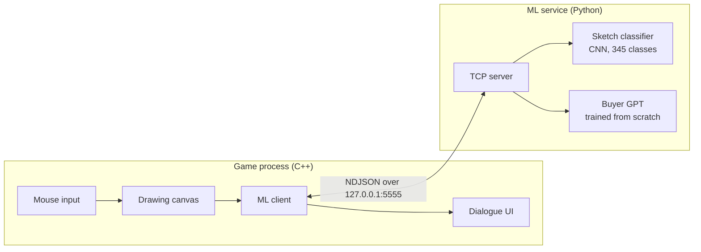
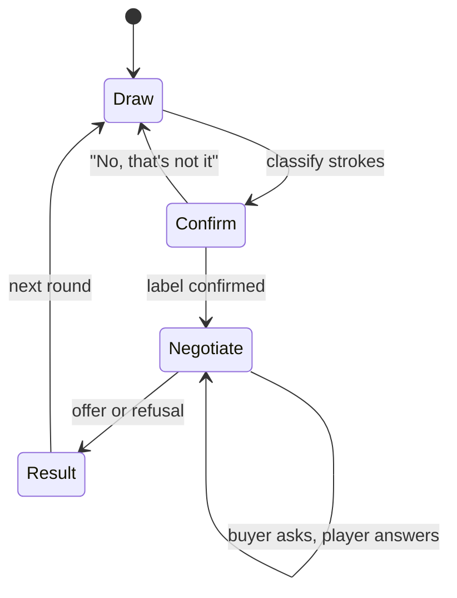

# Architecture

## Why two processes?

| Option | Pros | Cons |
|---|---|---|
| **Local socket (chosen)** | Engine has no Python dependency; each side is testable alone; the model can be swapped without rebuilding the game | Must start two processes; small serialization cost |
| Embed CPython (pybind11) | One process | Engine build depends on a Python install; crashes take down the game |
| Export to ONNX, run in C++ | Single native binary | Have to reimplement tokenization and sampling for the GPT in C++ |

The socket keeps the boundary clean while the models are still changing quickly.
Once they are stable, the sketch classifier is a good candidate to move into the engine via ONNX Runtime.

## Game flow

## Models

### Sketch classifier
- Input: player strokes, rasterized to 28×28 the same way as the Quick, Draw! bitmap release
- Output: top-k labels over 345 classes
- The game asks the player to confirm the top label before the negotiation starts

### Buyer GPT
- Decoder-only transformer, trained from scratch: tokenizer → pre-training → general SFT → task SFT → DPO
- The confirmed label is passed in as the item, so the GPT never has to look at the drawing
- The final turn uses a fixed format (`[OFFER]` / `[REASON]` or `[REFUSE]`) so the game can parse it
